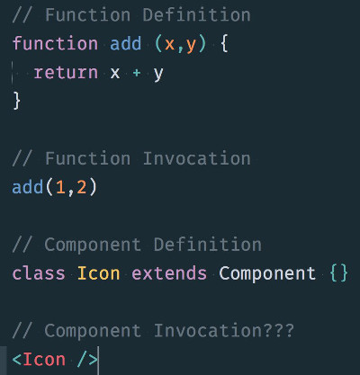

A few months ago I had, what I thought, was a simple question that I [posted to
Twitter](https://twitter.com/tylermcginnis33/status/771087982858113024).

<figure>
  <a href="https://twitter.com/tylermcginnis33/status/771087982858113024">
    
  </a>
</figure>

What surprised me wasn’t the joint confusion around this question, but instead
was the amount of inaccurate responses I received.

> Instances / Instantiation<br> Rendering<br> Evaluation<br> Invocation<br> “Using
> it :)”

The primary reason for the confusion is that there’s an often un-talked about
abstraction layer between JSX and what’s actually going on in React land. In
order to answer this question, we need to take a deep dive into that
abstraction.

Let’s start by looking at the absolute fundamentals of React. What is React?
It’s a library for building user interfaces. No matter how complex React or the
React ecosystem seem to be, this is React at its core — building UIs. With this
in mind, we arrive at our first definition, an **Element**. Simply put, *a React
element describes what you want to see on the screen*. Not so simply put, *a
React element is an object representation of a DOM node*. Notice I used the word
*describe*. It’s important to note that a React element isn’t actually the thing
you’ll see on your screen, instead, it’s just an object representation of it.
There’s a few reasons for this. The first is that JavaScript objects are
lightweight — React can create and destroy these elements without too much
overhead. The second reason is React is able to analyze the object, then analyze
the actual DOM, and then update the actual DOM only where a change occurred.
This has some performance upsides to it.

In order to create our object representation of a DOM node (aka React element),
we can use React’s *createElement* method.

```javascript
const element = React.createElement(
  'div',
  {id: 'login-btn'},
  'Login'
)
```

*createElement* takes in three arguments. The first is a tag name string (div,
span, etc), the second is any attributes you want the element to have, the third
is contents or the children of the element, in this case the text “Login”. The
*createElement* invocation above is going to return an object with this shape,

```javascript
{
  type: 'div',
  props: {
    children: 'Login',
    id: 'login-btn'
  }
}
```

and when it’s rendered to the DOM (using ReactDOM.render), we’ll have a new DOM
node that looks like this,

    <div id='login-btn'>Login</div>

So far, so good. What’s interesting about learning React is that typically the
first thing you’re taught is components. “Components are the building blocks of
React”. Notice, however, that we started this post with elements. The reason for
this is because once you understand elements, understanding components is a
smooth transition. *A component is a function or a Class which optionally
accepts input and returns a React element.*

```javascript
function Button ({ onLogin }) {
  return React.createElement(
    'div',
    {id: 'login-btn', onClick: onLogin},
    'Login'
  )
}
```

By definition, we have a Button component which accepts an onLogin input and
returns a React element. One thing to note is that our Button component receives
an *onLogin* method as its prop. To pass that along to our object representation
of the DOM, we pass it along as the second argument to createElement, just as we
did our id attribute.

Let’s go deeper.

Up until this point we’ve only covered creating React elements with the “type”
property of native HTML elements (“span”, “div”, etc), but you can also pass in
other React components to the first argument of createElement.

```javascript
const element = React.createElement(
  User,
  {name: 'Tyler McGinnis'},
  null
)
```

However, unlike with an HTML tag name, if React sees a *class *or a* function*
as the first argument, it will then check to see what element it renders, given
the corresponding props. React will continue to do this until there are no more
createElement invocations which have a class or a function as their first
argument. Let’s take a look at this in action.

```javascript
function Button ({ addFriend }) {
  return React.createElement(
    "button",
    { onClick: addFriend },
    "Add Friend"
  )
}

function User({ name, addFriend }) {
  return React.createElement(
    "div",
    null,
    React.createElement(
      "p",
      null,
      name
    ),
    React.createElement(Button, { addFriend })
  )
}
```

Above we have two components. A Button and a User. User’s object representation
of the DOM will be a “div” with two children, a “p” which wraps the user’s name
and a Button component. Now let’s swap out the createElement invocations with
what they return,

```javascript
function Button ({ addFriend }) {
  return {
    type: 'button',
    props: {
      onClick: addFriend,
      children: 'Add Friend'
    }
  }
}

function User ({ name, addFriend }) {
  return {
    type: 'div',
    props: {
      children: [
        {
          type: 'p',
          props: {
            children: name
          }
        },
        {
          type: Button,
          props: {
            addFriend
          }
        }
      ]
    }
  }
}
```

You’ll notice in the above code we have four different type properties,
“button”, “div”, “p”, and Button. When React sees an element with a function or
class type (like our *“type: Button”* above), it will then consult with that
component to know which element it returns, given the corresponding props. With
that in mind, at the end of this process, React has a full object representation
of the DOM tree. In our example, that will look like this,

```javascript
{
  type: 'div',
  props: {
    children: [
      {
        type: 'p',
        props: {
          children: 'Tyler McGinnis'
        }
      },
      {
        type: 'button',
        props: {
          onClick: addFriend,
          children: 'Add Friend'
        }
      }
    ]
  }
}
```

This whole process is called reconciliation in React and it’s triggered every
time setState or ReactDOM.render is called.

So now let’s again take a look at our initial question that sparked this blog
post,

<figure>
  <a href="https://twitter.com/tylermcginnis33/status/771087982858113024">
    
  </a>
</figure>

At this point we have all the knowledge we need to answer this question except
for one important piece. Odds are if you’ve been using React for any amount of
time, you don’t use React.createElement to create your object representations of
the DOM. Instead, you’re probably using JSX. Earlier I wrote “The primary reason
for the confusion is that there’s an often un-talked about abstraction layer
between JSX and what’s actually going on in React land.”. This abstraction layer
is that *JSX is always going to get transpiled to React.createElement
invocations (typically) via Babel.*

Looking at our earlier example, this code

```javascript
function Button ({ addFriend }) {
  return React.createElement(
    "button",
    { onClick: addFriend },
    "Add Friend"
  )
}

function User({ name, addFriend }) {
  return React.createElement(
    "div",
    null,
    React.createElement(
      "p",
      null,
      name
    ),
    React.createElement(Button, { addFriend })
  )
}
```

is the result of this JSX being transpiled.

```javascript
function Button ({ addFriend }) {
  return (
    <button onClick={addFriend}>Add Friend</button>
  )
}

function User ({ name, addFriend }) {
  return (
    <div>
      <p>{name}</p>
      <Button addFriend={addFriend}/>
    </div>
  )
}
```

So finally, what do we call it when we write out our component like this,
```<Icon/>```?

We can call it “creating an element” because after the JSX is transpiled,
that’s exactly what’s happening.

```javascript
React.createElement(Icon, null)
```

All of these examples, are “creating a React element”

```
React.createElement('div', className: 'container', 'Hello!')

<div className='container'>Hello!</div>

<Hello />
```

> For more reading on this subject see ["React Components, Instances, and Elements"](https://facebook.github.io/react/blog/2015/12/18/react-components-elements-and-instances.html) by Dan Abramov.
